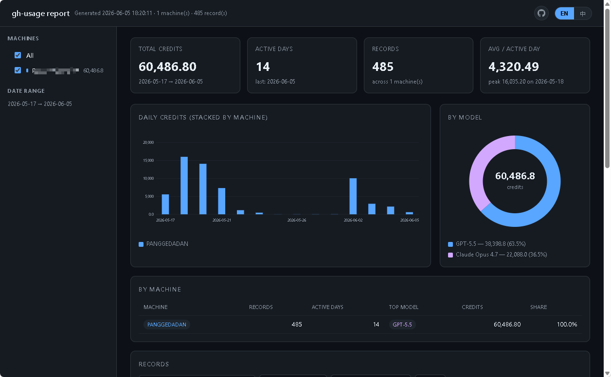

# gh-usage

English | [简体中文](README.zh-CN.md)

Fast local GitHub Copilot usage reports from VS Code and Copilot CLI records.

`gh-usage` helps individuals and teams understand local GitHub Copilot credit usage without waiting for a central report. It scans usage records already stored on the machine, summarizes the results, and writes both spreadsheet-friendly CSV data and a self-contained HTML report.

It is designed for local analysis, internal review, and operational visibility. It is not a replacement for GitHub billing or official usage reports.

## What it helps answer

- How many Copilot credits were found on this machine?
- Which days had the highest usage?
- Which models and sources contributed to the usage?
- Which chats or sessions created the detailed records?
- How does usage compare across multiple machines?
- Can the results be shared as a simple report without setting up a server?

## Highlights

- **Local-first:** scans files already available on the current machine.
- **Fast:** implemented in Rust and suitable for large VS Code history folders.
- **Business-readable output:** prints a compact terminal summary and writes an HTML report for review.
- **Spreadsheet-ready details:** exports CSV by default, with optional JSON for automation.
- **Multi-machine aggregation:** combines CSV files from multiple computers into one merged report.
- **Cross-platform:** supports Windows, Linux, and macOS VS Code data locations.

## Install

### Windows

Install from Windows Package Manager:

```powershell
winget install gh-usage
```

Upgrade later:

```powershell
winget upgrade gh-usage
```

### Linux and macOS

Download the matching archive from the [Releases page](https://github.com/kukisama/gh-usage/releases), extract it, and run the `gh-usage` binary.

## Quick start

Run a local scan:

```powershell
gh-usage
```

By default, the command writes two files in the current directory:

- `copilot-usage-<machine>.csv`: detailed records for spreadsheet analysis
- `copilot-usage-<machine>.html`: an interactive report for review and sharing

The terminal also prints a compact summary:

```text
+- GitHub Copilot Usage ---------------------------------+
| records                489  scanned files           82 |
| total credits      60122.2  candidate lines         49 |
| active days             14  parse errors             0 |
| avg / day           4294.4  total time          1.05 s |
+- Daily credits ----------------------------------------+
| 2026-06-02     74 records     10053.30 credits         |
| 2026-06-03     30 records      2942.00 credits         |
| 2026-06-04     42 records      2159.50 credits         |
+- Files ------------------------------------------------+
| csv   .\copilot-usage-workstation.csv                  |
| html  .\copilot-usage-workstation.html                 |
+--------------------------------------------------------+
```

The numbers above are examples. Your report depends on the local records available on your machine.

The generated HTML report looks like this:



## HTML report

The HTML report is self-contained and can be opened in any browser. It includes:

- total records, total credits, active days, and average credits per active day
- daily usage chart
- model and source breakdowns
- per-machine summary when merged data is available
- searchable and filterable record table
- pagination for large reports
- language toggle for the report UI

No server, database, or internet connection is required to view the generated report.

## CSV details

The CSV contains one row per extracted usage record. Commonly used columns include:

- `hostname`: machine that produced the record
- `local_time_hint`: local timestamp when available
- `chat_title`: chat title when available
- `source`: record source, such as VS Code chat history or Copilot CLI logs
- `model`: model name parsed from the record
- `credits`: credits consumed by the record
- `details`: raw credit detail text
- `file`: local source file scanned
- `line`: source line number

CSV files include a UTF-8 BOM by default for better Windows Excel compatibility. Use `--no-bom` to disable it.

## Common usage scenarios

Include GitHub Copilot CLI logs:

```powershell
gh-usage --include-cli-logs
```

Scan only recent records:

```powershell
gh-usage --since-days 7
```

Write to a specific location:

```powershell
gh-usage --output .\reports\copilot-usage.csv --html .\reports\copilot-usage.html
```

Export JSON instead of CSV:

```powershell
gh-usage --format json --output .\reports\copilot-usage.json --no-html
```

Skip the HTML report:

```powershell
gh-usage --no-html
```

## Merge reports from multiple machines

When several machines are involved, run `gh-usage` on each one and collect the generated `copilot-usage-<machine>.csv` files into a single folder.

Then run:

```powershell
gh-usage --merge .\shared\copilot-usage
```

Merge mode:

- reads every `copilot-usage-*.csv` file in the target folder
- skips local scanning entirely
- deduplicates repeated records
- writes `copilot-usage-merged.html` next to the CSV files
- keeps machine-level filtering and summaries in the report

This is useful for team reviews, device migrations, or comparing usage across a workstation and a laptop.

## Data scope and limitations

- `gh-usage` scans local files only.
- It uses the standard VS Code user-data location for the current OS unless a custom path is provided.
- Deleted or unavailable local history cannot be reconstructed.
- Records without credit details are ignored.
- Results are intended for analysis and rough comparison, not official accounting.

## Useful options

```text
--include-cli-logs       Include GitHub Copilot CLI records
--since-days <N>         Only scan files modified within the last N days
--output <PATH>          Write CSV or JSON to a specific path
--html <PATH>            Write the HTML report to a specific path
--no-html                Do not generate the HTML report
--merge [DIR]            Merge existing copilot-usage-*.csv files into one report
--format csv|json        Choose output format
--hostname <NAME>        Override the machine name stored in records
```

Run `gh-usage --help` for the full command reference.
