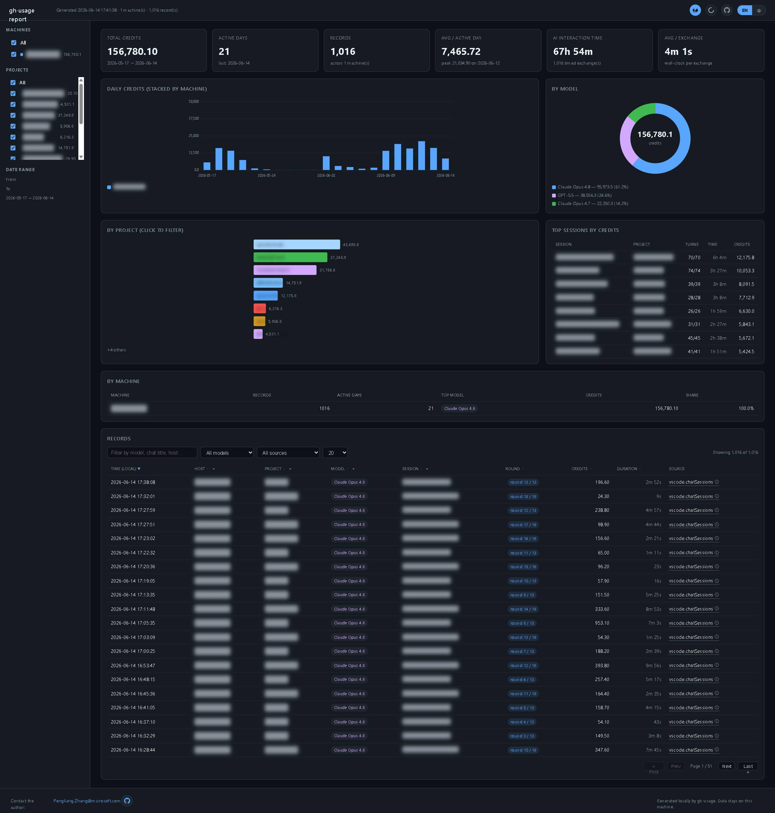
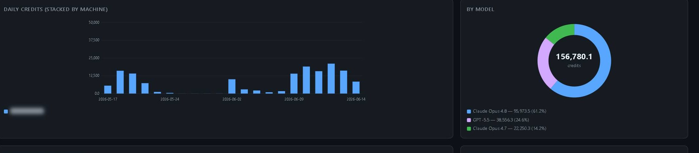
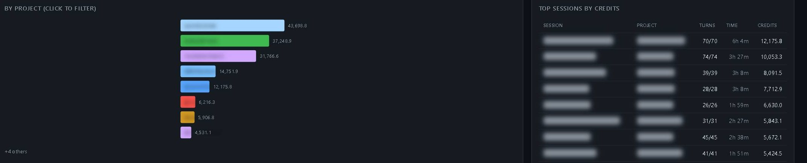
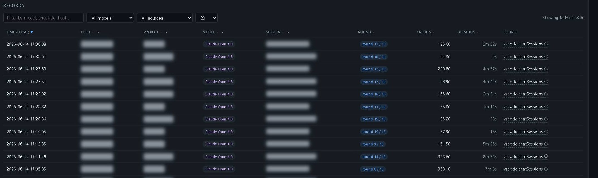

# gh-usage · See your Copilot usage at a glance

English | [简体中文](design/README.zh-CN.md)

[](LICENSE)
[](https://www.rust-lang.org/)
[](#-getting-started)
[](https://github.com/kukisama/gh-usage/releases)

> One command turns your scattered local GitHub Copilot usage records into a clean, visual report.
> Nothing is uploaded, nothing phones home — your data stays on your machine.



---

## 🙋 Who it's for

- **Heavy Copilot users** who want to see how many credits they spent this month, which days were busiest, and which model they rely on most.
- **Team leads and engineering managers** who need a quick read on usage across people and projects for reviews and planning.
- **Anyone who reports on their work** and wants a report they can screenshot and share, instead of raw logs.

---

## ✨ Highlights

### ⚡ Fast

Written in Rust, it scans local history directories quickly with a light footprint. In one local run, it processed **877 files** and extracted **1,020 records** in **1.52 seconds**.

```text
+- GitHub Copilot Usage ---------------------------------+
| records               1020  scanned files          877 |
| total credits     157204.3  candidate lines        102 |
| active days             21  parse errors             0 |
| avg / day           7485.9  total time          1.52 s |
+--------------------------------------------------------+
```

### 🔒 Local and private

- **Runs entirely on your machine.** It only reads files that already exist locally — nothing is uploaded.
- **One-click privacy mask.** A built-in toggle blurs hostnames, project names, and session titles, so screenshots are safe to share.
- **You own the data.** Every result is written to a local file you choose — keep it or delete it, your call.

### 🖥️ A report that's easy to use

The report is a **single self-contained HTML file** — double-click to open it in any browser. No database, no server, no internet required. Clean dark theme, tidy layout, and built-in English/Chinese switching.

---

## 📊 What's in the report

### Key metrics at a glance

Total credits, active days, record count, daily average, total AI interaction time, and average time per exchange — the numbers you care about, right at the top.


### Trends and model breakdown

A daily bar chart shows which days were busiest, and a donut chart breaks down each model's share at a glance.



### Drill down by project and session

A per-project bar chart lets you click to filter, and a "top sessions by credits" list shows exactly where your usage went.



### A searchable, filterable records table

The records table supports keyword search, filtering by model and source, click-to-sort columns, and pagination. The screenshot below has privacy mode on — sensitive fields are masked automatically.

**Read it as session → user turn.** A turn is one user request and the ensuing agent work, not an individual tool, MCP, or subagent call. The table shows one row per known turn with its recorded total, including recorded subtask usage, without expanding child billing. CLI model records sharing a turn are combined for display; the CSV/JSON keeps the source aggregates for audit. Old CLI session totals without turn information are labelled as summaries, not invented turns.

**New and old VS Code logs are both supported.** The scanner replays snapshots and updates, using cumulative `copilotCredits` when available and `result.details` for older logs. If both exist, it selects the more complete total (allowing for the footer's rounding), never their sum. Already-included subagent costs are not added again. Active/interrupted turns can appear without a final footer; missing usage in another turn does not renumber later turns. Model labels describe turn-level attribution, not a per-subagent model bill.

Rewind/retry does not refund already recorded usage: identifiable earlier requests are retained as **historical turns** and included in the session's exchange count and credits, even when no longer visible in the current chat.

For Copilot CLI records, `events.jsonl` remains the traceable source while SQLite supplies precise credits and timing. Open a row's source popover and choose **Open** to jump to the matching JSONL event line in VS Code.



### Sidebar filters

Filter by machine, project, or date range from the left, and the report updates live — no setup required. Date shortcuts cover the last 7 days, 30 days, 3 months, or all data (the default), with custom start/end dates still available.


### Optional cost estimates

Cost display is off by default. Turn it on to switch usage values and charts from AI credits to estimated USD or CNY. The report uses GitHub's official rate of **1 AI credit = $0.01 USD**. The default USD→CNY rate is **6.75 (reference date: 2026-08-06)** and remains editable because currency rates change. Links to the GitHub billing dashboard, [official AI Credits documentation](https://docs.github.com/en/copilot/concepts/billing/usage-based-billing-for-individuals), and [UsagePricing](https://www.usagepricing.com/blueprint/github-copilot) are included beside the controls.

### One-click screenshot

The camera button in the top-right saves the **entire page** as a single image (a crisp JPEG, around 430 KB). Privacy masking turns on automatically while capturing, so it's safe to share.

---

## 🚀 Getting started

### 1. Install

**Windows** (via the Windows Package Manager):

```powershell
winget install gh-usage
```

Upgrade:

```powershell
winget upgrade gh-usage
```

**Linux / macOS:** download the archive for your platform from the [Releases page](https://github.com/kukisama/gh-usage/releases), unpack it, and run `gh-usage`.

### 2. Run

Run it from your terminal:

```powershell
gh-usage
```

It writes two files to the current directory:

- `copilot-usage-<machine>.csv` — import into Excel for deeper analysis
- `copilot-usage-<machine>.html` — the report you open with a double-click

### 3. Open the report

Run `gh-usage --view` to generate a fresh report and open it in your default browser immediately. `gh-usage -v` is the short form; `gh-usage -view` also works when `-view` is the first argument. CSV export is retained, and the terminal exits without waiting for a keypress.

Alternatively, double-click an existing HTML file. Search, filter, switch language, toggle privacy, and save a screenshot — all from the page.

---

## 🛠️ Common commands

Generate and open the report in one step: `gh-usage --view`. Combine it with filters, for example `gh-usage --view --since-days 7`, or choose a report path with `gh-usage --view --html report.html`.

`--view` cannot be combined with `--no-html`. With `--output -`, CSV/JSON stays on stdout while HTML is saved as `copilot-usage-<machine>.html` in the current directory (or at `--html <PATH>`). Browser-launch messages go to stderr. Without `--view`, terminal and automation runs still do not open a browser. A desktop/default HTML handler is required; launch errors are reported without deleting the generated files.

VS Code and GitHub Copilot CLI records are both included by default. To scan VS Code only:

```powershell
gh-usage --no-cli-logs
```

Scan only the last week:

```powershell
gh-usage --since-days 7
```

Write to a specific location:

```powershell
gh-usage --output .\reports\copilot-usage.csv --html .\reports\copilot-usage.html
```

Export JSON for automation, skip the HTML:

```powershell
gh-usage --format json --output .\reports\copilot-usage.json --no-html
```

### Merge reports from multiple machines

Run `gh-usage` on each machine, collect the `copilot-usage-*.csv` files into one folder, then:

```powershell
gh-usage --merge .\shared\copilot-usage
```

It reads every CSV, deduplicates records, and produces one combined report with a per-machine breakdown — handy for swapping machines, team reviews, or comparing your desktop against your laptop.

Add `--view` to open the merged report immediately: `gh-usage --merge .\shared\copilot-usage --view`. Use `--html <PATH>` to override the merged HTML destination; relative paths are resolved from the current working directory.

---

## 📄 CSV fields

Each row is one usage record. Common fields include machine name, local time, session title, source, model, credits spent, the raw credit details, and the source file and line number. The CSV includes a UTF-8 BOM by default so Windows Excel opens it cleanly (use `--no-bom` to turn it off).

---

## ⚠️ Good to know

`gh-usage` is built for **local analysis and review** — great for spotting trends and rough comparisons, but **not a replacement for GitHub's official billing or usage reports**.

- It only reads files that exist locally; deleted history can't be recovered.
- Turns without any valid cumulative credits or legacy credit details are skipped; unknown usage is not assumed to be free. Active turns can grow after a report is generated.
- USD/CNY values are estimates for local analysis. Exchange rates are user-configurable, and GitHub's billing page remains authoritative.
- Copilot CLI event JSONL is the primary trace. The session title comes from `workspace.yaml.name` (or the first real JSONL user message when unnamed), and `workspace.yaml.cwd` identifies the project. `session-store.db` contributes exact credits, duration, and turn metadata only when its usage row matches a JSONL response.
- It uses your system's standard VS Code and Copilot CLI data directories by default, and supports custom paths.

---

## 📚 Options

```text
--no-cli-logs            Skip GitHub Copilot CLI records
--since-days <N>         Only scan files modified within the last N days
--output <PATH>          Write CSV or JSON to a specific path
--html <PATH>            Write the HTML report to a specific path
--view, -v               Generate HTML and open it in the default browser
--no-html                Do not generate the HTML report
--merge [DIR]            Merge existing copilot-usage-*.csv files into one report
--format csv|json        Choose the output format
--hostname <NAME>        Override the machine name stored in records
```

Run `gh-usage --help` for the full command reference.

---

## 📜 License

Released under the [MIT License](LICENSE) — free to use, modify, and distribute.

## 🤝 Contributing

Issues and pull requests are welcome. If this tool helps you out, a ⭐ Star is always appreciated.

---

<sub>Generated locally by gh-usage · your data stays on your machine.</sub>
