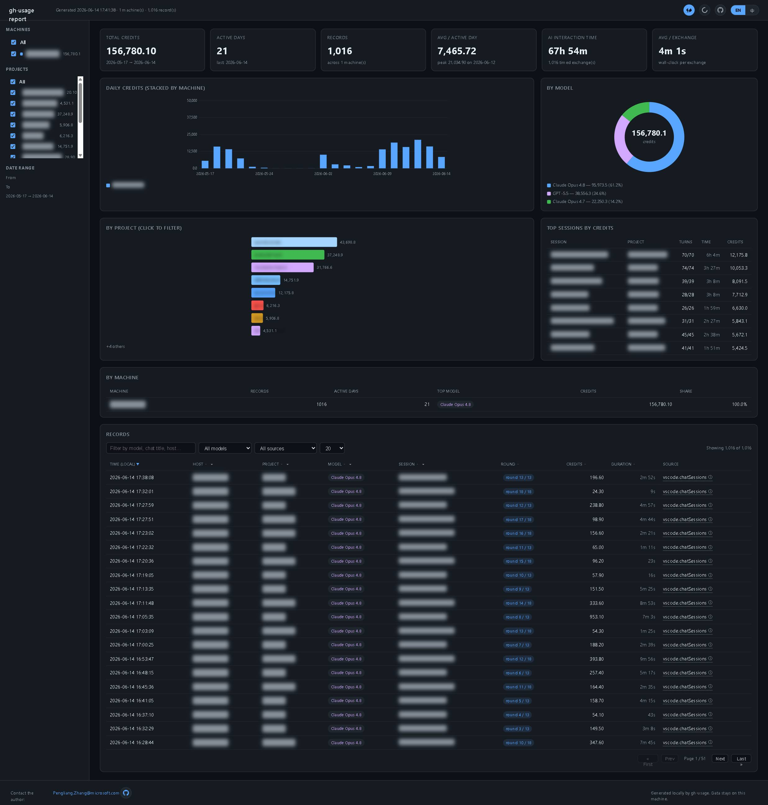
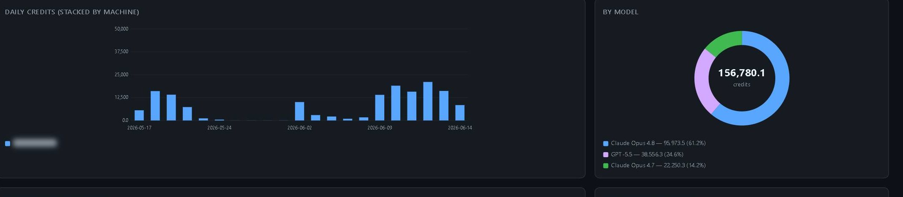
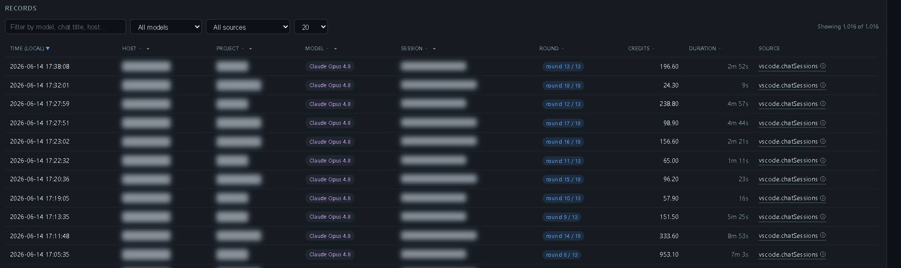

# gh-usage · 一眼看懂你的 Copilot 用量

[English](README.md) | 简体中文

[](LICENSE)
[](https://www.rust-lang.org/)
[](#-三步上手)
[](https://github.com/kukisama/gh-usage/releases)

> 一条命令，把本机零散的 GitHub Copilot 使用记录，整理成一份可视化报告。
> 不上传、不联网，数据始终留在你自己的电脑上。



---

## 🙋 适合谁用

- **重度 Copilot 用户**：想知道这个月用了多少额度（credits）、哪几天用得最多、主力模型是哪个。
- **团队负责人 / 技术主管**：想看清成员之间、项目之间的用量分布，便于复盘和盘点。
- **需要对外汇报的人**：想要一份能直接截图发出去的报告，而不是一堆原始日志。

---

## ✨ 核心特性

### ⚡ 快

使用 Rust 编写，扫描本机历史目录高效、占用低。在一次本机实测中，它在 **1.52 秒**内处理了 **877 个文件**，提取出 **1020 条记录**。

```text
+- GitHub Copilot Usage ---------------------------------+
| records               1020  scanned files          877 |
| total credits     157204.3  candidate lines        102 |
| active days             21  parse errors             0 |
| avg / day           7485.9  total time          1.52 s |
+--------------------------------------------------------+
```

### 🔒 本地、私密

- **全程本地运行**：只读取电脑上已有的文件，不联网、不上传。
- **一键隐私遮蔽**：报告内置隐私开关，开启后主机名、项目名、会话标题都会被打码，截图分享更安心。
- **数据自己掌控**：所有结果都写入你指定的本地文件，留或删都由你决定。

### 🖥️ 报告好看也好用

报告是一个**单文件 HTML**，双击即可在任意浏览器打开——无需数据库、无需服务器、无需联网。深色主题、排版清爽，并内置中英文切换。

---

## 📊 报告里有什么

### 核心指标一览

总额度、活跃天数、记录条数、日均用量、AI 交互总时长、单次平均时长，关键数字都集中在顶部。


### 趋势与模型分布

每日用量柱状图帮你看出哪几天最忙，环形图直观展示各模型的占比。



### 按项目、会话深入

项目维度的横向条形图支持点击筛选，配合「最高消耗会话」榜单，定位用量都花在了哪里。


### 可搜索、可筛选的明细表

明细记录表支持关键词搜索、按模型/来源筛选、点击表头排序和分页。下图开启了隐私模式，敏感字段已自动打码。



### 侧边栏筛选

左侧可按机器、项目、日期范围勾选，报告实时联动，无需额外配置。


### 一键截图分享

报告右上角的相机按钮可把**整页**保存为一张图片（约 430 KB 的 JPEG，清晰且体积小）。截图时会自动开启隐私遮蔽，分享更放心。

---

## 🚀 三步上手

### 1. 安装

**Windows**（通过 Windows 包管理器）：

```powershell
winget install gh-usage
```

升级：

```powershell
winget upgrade gh-usage
```

**Linux / macOS**：到 [Releases 页面](https://github.com/kukisama/gh-usage/releases) 下载对应平台的压缩包，解压后运行 `gh-usage`。

### 2. 运行

在终端执行：

```powershell
gh-usage
```

它会在当前目录生成两个文件：

- `copilot-usage-<机器名>.csv`——可导入 Excel 做进一步分析
- `copilot-usage-<机器名>.html`——双击即可查看的报告

### 3. 打开报告

双击 HTML 文件即可。搜索、筛选、切换语言、开启隐私、保存截图，都在页面里完成。

---

## 🛠️ 常用命令

纳入 Copilot CLI 的记录：

```powershell
gh-usage --include-cli-logs
```

只扫描最近一周：

```powershell
gh-usage --since-days 7
```

输出到指定位置：

```powershell
gh-usage --output .\reports\copilot-usage.csv --html .\reports\copilot-usage.html
```

导出 JSON 用于自动化、不生成 HTML：

```powershell
gh-usage --format json --output .\reports\copilot-usage.json --no-html
```

### 合并多台电脑的报告

在每台机器上分别运行 `gh-usage`，把生成的 `copilot-usage-*.csv` 收集到同一文件夹，然后：

```powershell
gh-usage --merge .\shared\copilot-usage
```

它会读取所有 CSV、自动去重，并生成一份带「按机器对比」的汇总报告，适合换机、团队盘点或台式机与笔记本的对照。

---

## 📄 CSV 字段

每一行对应一条使用记录，常用字段包括：机器名、本地时间、会话标题、来源、模型、消耗额度、原始明细、源文件与行号。CSV 默认带 UTF-8 BOM，方便 Windows Excel 直接打开（用 `--no-bom` 可关闭）。

---

## ⚠️ 使用须知

`gh-usage` 用于**本地分析与复盘**，适合了解趋势、做粗略对比，但**不能替代 GitHub 官方账单或使用量报告**。

- 只扫描本机已有的文件，已删除的历史无法重建。
- 没有额度明细的记录会被跳过。
- 默认使用当前系统标准的 VS Code 数据目录，也支持自定义路径。

---

## 📚 选项一览

```text
--include-cli-logs       同时纳入 GitHub Copilot CLI 记录
--since-days <N>          只扫描最近 N 天内修改过的文件
--output <PATH>           将 CSV 或 JSON 写到指定路径
--html <PATH>             将 HTML 报告写到指定路径
--no-html                 不生成 HTML 报告
--merge [DIR]             合并已有的 copilot-usage-*.csv 为一份报告
--format csv|json         选择输出格式
--hostname <NAME>         覆盖记录中保存的机器名
```

运行 `gh-usage --help` 查看完整命令参考。

---

## 📜 许可

本项目基于 [MIT 许可证](LICENSE) 开源，可自由使用、修改和分发。

## 🤝 贡献

欢迎提交 Issue 与 Pull Request。如果这个工具对你有帮助，欢迎点一个 ⭐ Star。

---

<sub>由 gh-usage 在本地生成 · 数据始终留在你的电脑上。</sub>
